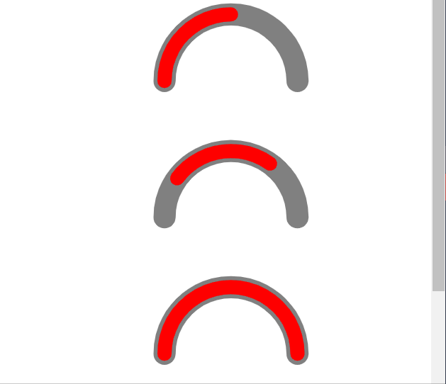

# react-svg-path-percentage
draw react svg path in percentage | svg path 按百分比绘制

示例：https://codesandbox.io/s/react-svg-path-percentage-0eupiq?file=/src/App.js


## usage | 使用

```
<PathPercentage percentage={50} offset={20}>
  <path
    d="M100 100 A 40 40 90 0 1 250 100"
  />
</PathPercentage>
```

